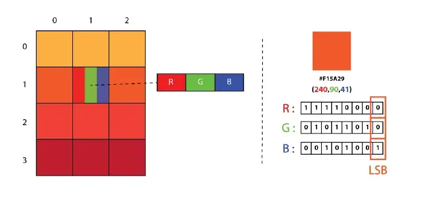

# Least Significant Bit

## What is Least Significant Bit Steganography technic?

LSB Steganography is an image steganography technique in which messages are hidden inside an image by replacing each
pixel’s least significant bit with the bits of the message to be hidden.

To understand better, let’s consider a digital image to be a 2D array of pixels.
Each pixel contains values depending on its type and depth.
We will consider the most widely used modes — RGB(3x8-bit pixels, true-color)
and RGBA(4x8-bit pixels, true-color with transparency mask).
These values range from 0–255, (8-bit values).

|  | 
|:--:| 
| **Figure 1:** *Showing the Least Significant Bit in a pixel* |

We can convert the message into decimal values and then into binary, by using the ASCII Table.
Then, we iterate over the pixel values one by one, after converting them to binary,
we replace each least significant bit with that message bits in a sequence.

To decode an encoded image, we simply reverse the process.
Collect and store the last bits of each pixel then split them into groups of 8
and convert it back to ASCII characters to get the hidden message.

## How are we implementing it?

Our tool offers `Simple Inline LSB Steganography` as explained above.

### Simple Inline LSB:

The steps for encoding are the following:
1. Take any image supported by pillow python package as input
2. Calculate the header space with the following: header_size = length(binary(w\*h\*3))
3. If the data to be hidden is a string add bit `0` at the beginning, if the data was a file add `1`
4. Check if data fits in the image, where the max data is: **_w\*h\*3 - header_size - 1_** *[1 being the extra bit added depending on the type of data]*
5. Calculate the length of the data and store in header
6. Loop on each pixel of the image to alter the LSB of each color and hide the data

The steps for decoding are the same but in reverse.

|  | 
|:--:| 
| **Figure 2:** *Image of size 12x12px* |

Calculating the header for the image above (**figure 2**) would be as following:

- w\*h\*3 = 12\*12\*3 = 432 bits
- binary(432) = 1 1011 0000
- length(1 1011 0000) = 9 bits
- And thus the header length is 9 bits

In addition, the maximal data size that can be hidden in this image is 432 - 9 - 1 = 422 bits

## TODO

1. Read [An Enhanced Least Significant Bit Steganography Method Using Midpoint Circle Approach](https://drive.google.com/file/d/1ElOvCFtjC5TPs9mUzla7P0DiQA2c1Irw/view?usp=sharing)